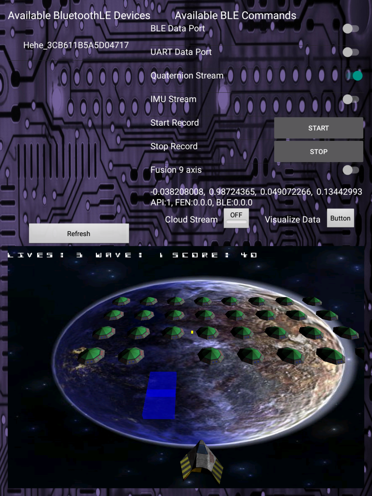
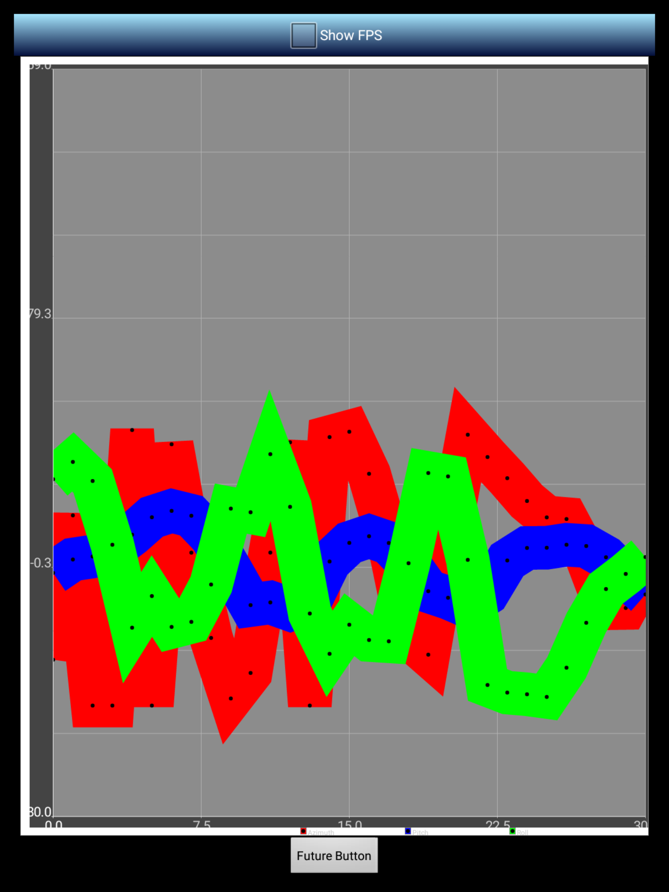

# Neblina Control Panel V2
This is an enhanced version of the Neblina Control Panel that works with V1 and V2 Neblina boards.
It allows users to connect to up to 8 Neblina devices and write various control aspects. This version
presents a Space Invaders visualization that you can use to verify connectivity to the gyroscope.
It syncs the motions of the spaceship to the motions of an active Neblina device.

<<<<<<< HEAD

    
=======

>>>>>>> c0556bb3c7c73df5cefb612bcc34fff058a19b6a
There is a second visualization that allows you to observe in real-time the accelerometer output.
This document will walk you through installing, running, and using the Neblina Control Panel V2.

# Pre-requisites

1. Github or similar VCS
2. Android Studio V2.2 or higher
3. SDK version 6.0 = API 23 (Marshmallow) or higher
4. An Android device with Bluetooth 4.1 or higher

# Compiling

1. Clone the motsai/neblina-android repository on your computer using github
2. Install Android Studio V2.2 or higher.
3. Open Android Studio
4. Go to File -> Open  and find the LibExperiments project at the location where you cloned the neblina-android repository.
5. Make sure you have the latest SDK version 6.0 installed
6. Plug in an Android device to your computer using it's USB cable
7. Make sure the Android device has developer mode enabled
8. In Android Studio go to Run -> Run (Or click on the green triangle)
9. You will need to accept the Bluetooth and associated coarse location tracking permissions
10. Enjoy the wonders of Neblina motion tracking :D

