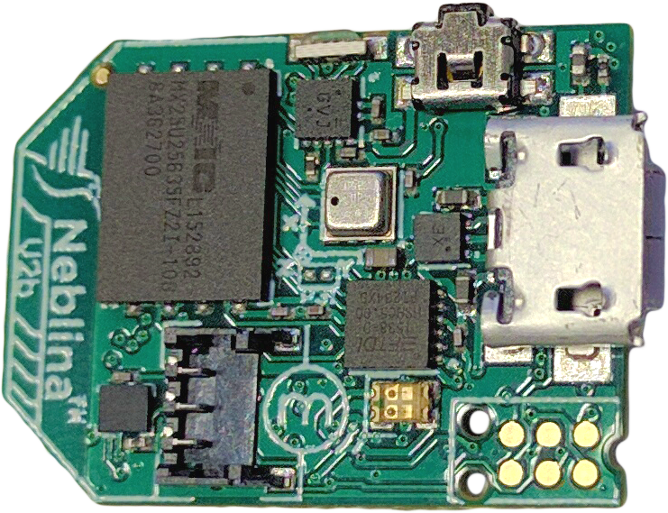
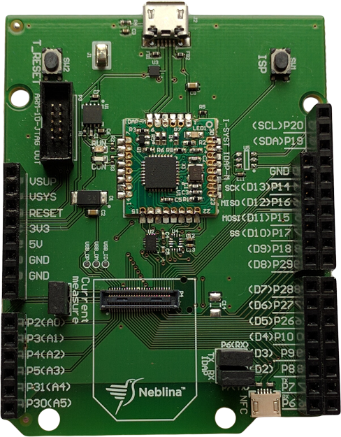
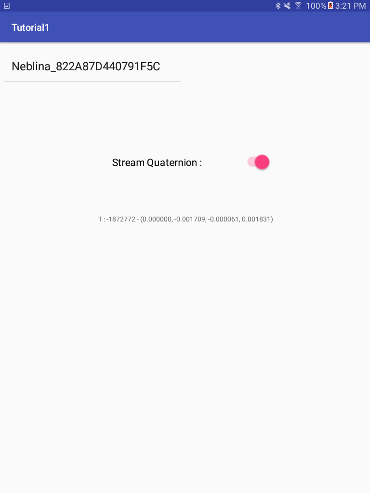

# Neblina&trade; Development Kit Android Java
=========  

  

## Neblina&trade;
The Neblina&trade; module is a low-power self-contained [AHRS](https://en.wikipedia.org/wiki/Attitude_and_heading_reference_system), [VRU](https://en.wikipedia.org/wiki/Inertial_measurement_unit) and [IMU](https://en.wikipedia.org/wiki/Inertial_measurement_unit) with [Bluetooth&reg; SMART](https://en.wikipedia.org/wiki/Bluetooth_low_energy) connectivity developed by Motsai. The miniature board built with the latest [HDI PCB](https://en.wikipedia.org/wiki/Microvia) technology, features a high-performance patent-pending sensor fusion algorithm on-board, that makes it perfect for [wearable technology devices](https://en.wikipedia.org/wiki/Wearable_technology) in applications such as [biomechanical analysis](https://en.wikipedia.org/wiki/Biomechanics), [sports performance analytics](https://en.wikipedia.org/wiki/Sports_biomechanics), remote [physical therapy](https://en.wikipedia.org/wiki/Physical_therapy) monitoring, [quantified self](https://en.wikipedia.org/wiki/Quantified_Self) , [health and fitness tracking](https://en.wikipedia.org/wiki/Activity_tracker), among others.

## Neblina&trade; Development Kit



The [Neblina&trade; Development Kit](http://neblina.io/) serves as a reference design for Neblina integration, I/O expansion and an onboard Debug J-Tag for custom firmware development. The development kit with the extensive software support allows system integrators and evaluators to start development within minutes.

This repository is part of the development kit that provides a Java interface to interact with the Neblina&trade;.


### Prerequisite

* Have on hand a Neblina&trade; module or Development Kit
* An Android Phone or Tablet with Bluetooth LE capability.
* Android 6.0 (Marshmallow) or above.
* Clone or download this repo.
* Android Studio 2.3 is required to compile
* Android programming skills

### Functional check  

Follow the hardware [Quick Start guide](http://nebdox.motsai.com/ProMotion_DevKit/Getting_Started) to make sure that the Neblina&trade; module or Development Kit is powered on and functional.

Download or Clone this repo using the command

```
$ git clone https://github.com/Motsai/neblina-android.git
```

Open the Tutorial1 project, compile and execute the App.  The initial screen will list all available Neblina&trade; devices found.  Select one of the Neblina&trade; that shows up.  It will automatically connect to the Neblina&trade; and begin streaming Quaternion.

Tutorial1 Screen Shot




### Need to know when creating new project

In order to use the Neblina&trade; API in a new project the source files Neblina.java, NeblinaDelegate.java & NebCmdItem.java are needed to import into the project.  One way to do this in the Android Studio is to add the source path into the 'build.grade (Module : app)' inside 'android {' as shown bellow.  

```
android {
  ...
  sourceSets {
      main.java.srcDirs += '../../src'
  }
}
```

To enable Bluetooth support in the App.  Permission settings are required.  The following are needed to be added into the AndroidManifest.xml of the project.

```
<uses-permission android:name="android.permission.BLUETOOTH"/>
<uses-permission android:name="android.permission.BLUETOOTH_ADMIN"/>
<uses-feature android:name="android.hardware.bluetooth_le" android:required="true"/>
<uses-permission android:name="android.permission.ACCESS_FINE_LOCATION" />
<uses-permission android:name="android.permission.ACCESS_COARSE_LOCATION" />
```


#### API documentations

http://nebdox.motsai.com

# NOTE : This repository is still under heavy development.
